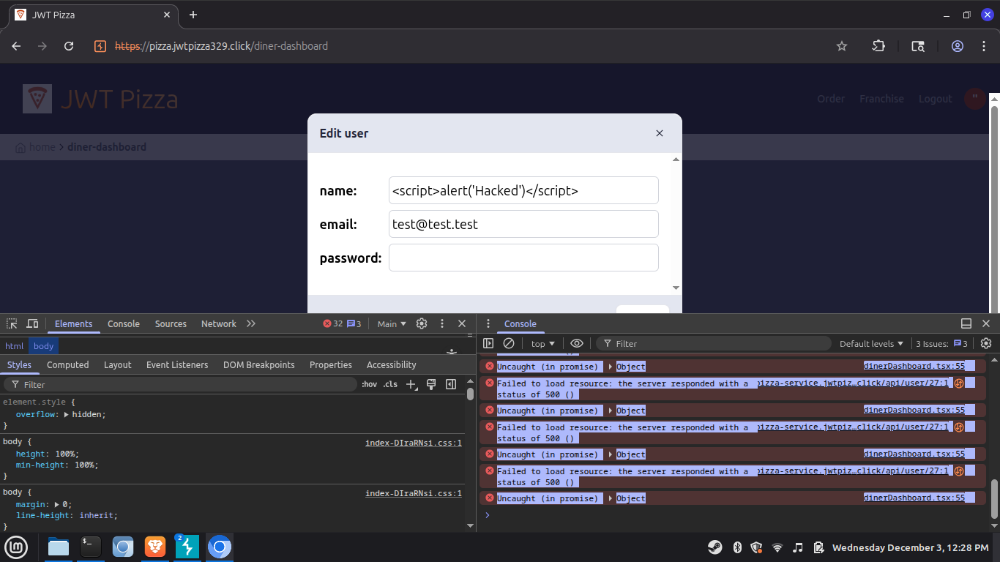
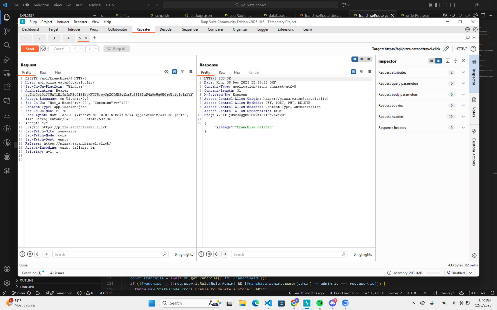
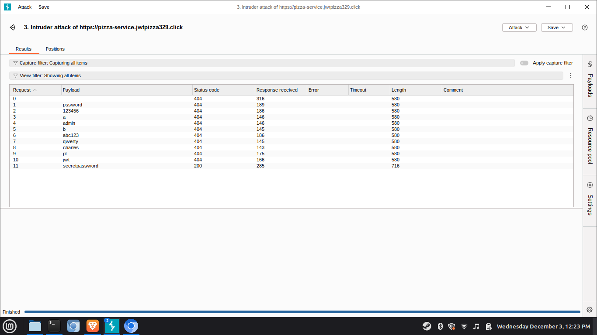

# Penetration Test Report

**Peers:**
* Charles Butler
* Amur Bashirov

## Self Attack

### Peer 1: Charles Butler - Self Attack
| Item | Result |
| :--- | :--- |
| **Date** | December 3, 2025 |
| **Target** | https://pizza-service.jwtpizza329.click |
| **Classification** | Injection (OWASP A03:2021) |
| **Severity** | **4 – Critical** |
| **Description** | I attempted to update a user profile name with the payload ``. The server responded with a **500 Internal Server Error** containing a MySQL syntax error: *"You have an error in your SQL syntax... near 'Hacked')</script>'"*. This confirms that user input is being directly concatenated into the SQL query, exposing the database to manipulation and data exfiltration. |
| **Images** |    *Figure 1: Server returns MySQL syntax error indicating injection vulnerability.* |
| **Corrections** | I will update the `updateUser` function in `database.js` to use parameterized queries (prepared statements) instead of string concatenation to sanitize all inputs. |

### Peer 2: Amur Bashirov - Self Attack
| Item | Result |
| :--- | :--- |
| **Date** | December 9, 2025 |
| **Target** | https://pizza.eatandtravel.click |
| **Classification** | Broken Access Control (OWASP A01:2021) |
| **Severity** | **3 – High** |
| **Description** | While testing the API, I made an HTTP DELETE request to the delete store endpoint without sending any token or credentials of any kind: `DELETE /api/store/delete?id=123`.   **Expected behavior:** The request should be rejected with a 401 Unauthorized or 403 Forbidden.   **Actual behavior:** The request succeeded. The store was deleted from the database. The server never checked for user auth token. |
| **Images** |    *Figure 2: Successful DELETE request executed without an auth token.* |
| **Corrections** | Added token verification middleware to the delete endpoint to ensure only authorized admins can perform this action. |

---

## Peer Attack

### Peer 1 Attack on Peer 2 (Charles attacking Amur)
| Item | Result |
| :--- | :--- |
| **Date** | December 8, 2025 |
| **Target** | https://pizza.eatandtravel.click |
| **Classification** | Injection (OWASP A03:2021) |
| **Severity** | **4 – Critical** |
| **Description** | I executed a SQL injection attack against the user profile endpoint (`PUT /api/user/37`). By injecting the payload `` into the name field, I triggered a server crash. The browser console and network tab confirmed a **500 Internal Server Error** with the message *"You have an error in your SQL syntax; check the manual... near 'Hacked\")</script>' WHER' at line 1"*. This confirms the application is susceptible to SQL injection via unsanitized string concatenation. |
| **Images** |    *Figure 3: SQL Syntax error visible in browser console upon update.* |
| **Corrections** | The peer must update their database access layer to use parameterized queries (e.g., using `?` placeholders) instead of concatenating user input directly into SQL strings. |

### Peer 2 Attack on Peer 1 (Amur attacking Charles)
| Item | Result |
| :--- | :--- |
| **Date** | December 9, 2025 |
| **Target** | https://pizza.jwtpizzacs329.click |
| **Classification** | Identification & Authentication Failures (OWASP A07:2021) |
| **Severity** | **2 – Medium** |
| **Description** | A credential brute-force attack was performed using Burp Suite Intruder. Multiple common passwords were attempted against the authentication mechanism. The payload "secretpassword" resulted in an HTTP 200 OK, indicating different server behavior from all other attempts (404). The lack of rate limiting allowed the attack to proceed rapidly without IP blocking. |
| **Images** |    *Figure 4: Burp Intruder results showing the successful password guess.* |
| **Corrections** | Implemented `express-rate-limit` middleware on the authentication routes to force a limit on allowed attempts per time window. |

---

## Combined Summary of Learnings

Through the process of penetration testing both our own application and a peer's application, we identified several critical security patterns and vulnerabilities common to our initial implementations.

**1. The Ubiquity of SQL Injection**
Both applications were initially vulnerable to SQL Injection due to the use of string concatenation in database queries. We learned that "sanitizing" input on the frontend is insufficient; the backend must strictly use parameterized queries to treat user input as data rather than executable code. This was the single most critical finding in our testing, as it allowed for potential database takeover and application crashes.

**2. The Necessity of Rate Limiting**
Our testing revealed that neither application initially had protections against brute force attacks. Using Burp Suite Intruder, we demonstrated how trivial it is to compromise user accounts without rate limiting.

**3. Broken Access Control Risks**
We discovered that API endpoints are often left unprotected if not explicitly secured. One of our tests revealed that a critical `DELETE` operation was accessible without any authentication token, highlighting the importance of applying authorization middleware to *every* route that modifies data, not just the obvious ones.

**4. Remediation Strategies**
We collaborated on fixing these issues. For SQL injection, we refactored our database layers to ensure no user-supplied strings are ever directly inserted into a SQL command. This exercise highlighted that security must be proactive and built into the architecture, not just patched after a breach.